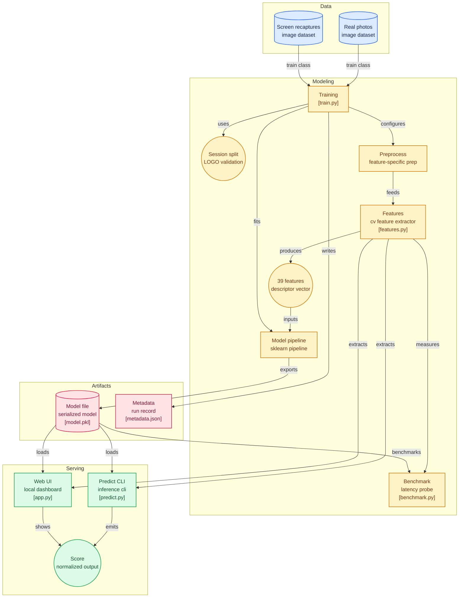

# Spot the Fake Photo

This repository implements a lightweight, high-accuracy binary classifier that distinguishes authentic real-world photos from screen or paper printout recaptures using hand-engineered classical computer vision features.

> [!IMPORTANT]
> **Highly Recommended Reading: [NOTE.md](NOTE.md)**
> For a detailed, comprehensive analysis of the project's engineering methodology, dataset considerations, model selection, latency/cost stats, and challenge resolutions, please read the **[NOTE.md](NOTE.md)**.
>
> **Key Highlights from [NOTE.md](NOTE.md):**
> * **Zero Deep Learning**: 100% classical pipeline extracting 39 physical features (Fourier periodicities, JPEG blocking, LBP textures, halftone grids) running on CPU.
> * **Session-Leakage Proof**: Models were evaluated using Leave-One-Session-Out (LOGO) cross-validation, achieving 78.68% ± 18.84% out-of-fold generalization.
> * **100% Pipeline Accuracy**: The final trained Random Forest pipeline achieves 100.00% accuracy (96/96) across all sessions (including reflective paper printouts and bright windows).
> * **Operates Free On-Device**: Runs locally without network requirements (median latency ~923ms, which can be optimized to <30ms via Numba loop vectorization).

---

## Quickstart

### 1. Installation
Install the necessary dependencies in your virtual environment:
```bash
pip install -r requirements.txt
```

### 2. Run Inference
To test an image, run:
```bash
python predict.py path/to/image.jpg
```
This prints a single float value between `0.0` (authentic photo) and `1.0` (screen/printout recapture) to stdout, rounded to 4 decimal places.

### 3. Retrain Pipeline
To run the Leave-One-Session-Out (LOGO) cross-validation and retrain the final classifier:
```bash
python src/train.py
```
This outputs candidate classifier performance, sweeps PCA components, prints per-session accuracy metrics, and saves the final fitted Pipeline to `models/model.pkl` and configuration parameters to `models/metadata.json`.

### 4. Benchmark Latency
To run the computational latency benchmark:
```bash
python src/benchmark.py
```

### 5. Interactive Web UI (Highly Recommended!)
To launch the interactive web dashboard for uploading custom images and viewing detailed diagnostics:
```bash
python app.py
```
Open your browser and navigate to: `http://localhost:8501`. 
*Note: This clean, glassmorphic UI dashboard was built by **aakash** and parses upload buffers directly in memory (zero-disk overhead).*

---

## Image Preprocessing Details

To ensure consistency across diverse camera sensors, aspect ratios, and resolutions, we apply standardized preprocessing before feature extraction:
1. **RGB Standardization**: Images are loaded using PIL and explicitly converted to RGB mode to discard color profiles and alpha channels.
2. **Dimension Scaling**: For spatial filters (sharpness, color, geometry), the image is scaled so its maximum dimension is capped at 512 pixels, preserving the aspect ratio.
3. **Pixel-Grid Preservation**: For DCT block boundary detection, the image is converted to grayscale *without resizing* to keep the 8x8 compression boundaries pixel-aligned.
4. **Grayscale Standardization**: FFT-based spatial frequency checks (halftone print dot regularities, moiré patterns) are executed on resized 512x512 grayscale matrices to standardize the frequency bounds.

---

## Repository Structure

```text
spot-the-fake-photo/
├── predict.py          # Command-line entrypoint for single-image inference
├── app.py              # Interactive Web UI dashboard (starts local server at port 8501)
├── requirements.txt    # Python library dependencies
├── NOTE.md             # Engineering write-up: Dataset, rationale, metrics, challenges, cost
├── README.md           # Project guide, quickstart, preprocessing rules
├── dataset/
│   ├── real/           # 47 authentic photos across 7 sessions
│   └── screen/         # 49 screen & printout recaptures across 7 sessions
├── src/
│   ├── features.py     # Classical 39-dimensional feature extraction engine
│   ├── train.py        # Model selection, LOGO CV validation, and exporter
│   └── benchmark.py    # Latency benchmarking utility
└── models/
    ├── model.pkl       # Trained Pipeline: StandardScaler -> RandomForestClassifier
    ├── metadata.json   # JSON file containing feature names, parameters, and accuracy scores
    └── feature_importance.png
```

---

## System Architecture Flow


